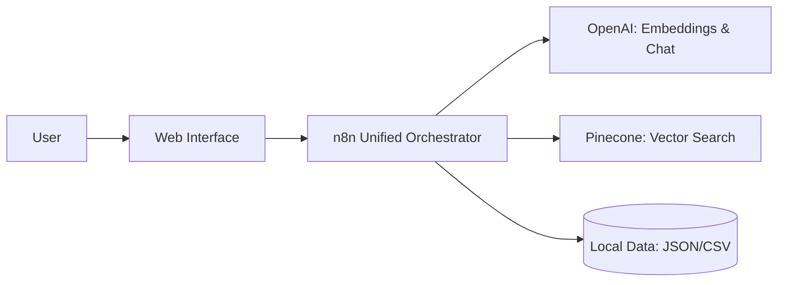

# 🏭 Manufacturing RAG System (Pure n8n)

> **A Production-Ready, Visual Orchestration System for Manufacturing Intelligence.**

This system leverages **n8n orchestration**, **Pinecone vector search**, and **GPT-4o-mini** to provide real-time manufacturing insights and advanced inventory forecasting—all without external Python dependencies.

---

## 🎯 Key Features

- **🚀 All-In-One Orchestration**: A single unified n8n workflow for intent classification, RAG, and forecasting.
- **📊 Advanced Forecasting**: Native JavaScript implementation of **Holt-Winters Triple Exponential Smoothing**.
- **🔍 Domain-Aware RAG**: Specialized chunking logic for manufacturing telemetry (OEE, Machine Faults, Shift Data).
- **🔒 Resilient Embedding Flow**: Custom logic to bypass n8n sandbox restrictions and ensure 768-dimension vector compatibility.
- **💬 Web Interface**: A premium, responsive chat UI for real-time interaction.

---

## 🏗️ Architecture

For a deep dive into the technical details, see [**ARCHITECTURE.md**](ARCHITECTURE.md).

---

## 🚀 Quick Start

### 1. Prerequisites
- **n8n** (Self-hosted or Cloud)
- **OpenAI API Key**
- **Pinecone API Key** (768-dimension index)

### 2. Workflow Setup
1. Import `n8n_workflows/00_Complete_Chat_AllInOne.json` into n8n.
2. Configure **credentials** for OpenAI and Pinecone inside n8n.
3. In the **Webhook** node, click the "Webhooks" tab and use the **Production URL**.
4. Toggle the workflow to **Active**.

### 3. Data Ingestion
1. Import `n8n_workflows/04_Data_Ingestion.json`.
2. Update the `Read CSV` node path to point to `data/machine_data.csv`.
3. Execute the workflow once to populate your Pinecone index.

### 4. Web Interface
1. Open `web/index.html` in your browser.
2. Update the webhook URL in `web/script.js` if necessary.

---

## 📈 Forecasting Engine
The system uses the **Holt-Winters** model implemented in pure JavaScript. It accounts for:
- **Level**: Base consumption.
- **Trend**: Growth or decline over time.
- **Seasonality**: Quarterly consumption patterns.
- **Safety Stock**: 20% buffer recommendations.

---

## 📂 Project Structure

- `n8n_workflows/`: Final, optimized JSON workflows.
- `web/`: Premium chat interface (HTML/CSS/JS).
- `data/`: Sample manufacturing and inventory datasets.
- `ARCHITECTURE.md`: Detailed technical documentation.

---

## 🏁 Submission Status
- ✅ **Pure n8n**: 100% logic migration completed.
- ✅ **Optimized**: No Python overhead or sandbox issues.
- ✅ **Verified**: Vector dimensions and RAG search matched.

**Built for Manufacturing Excellence.**
